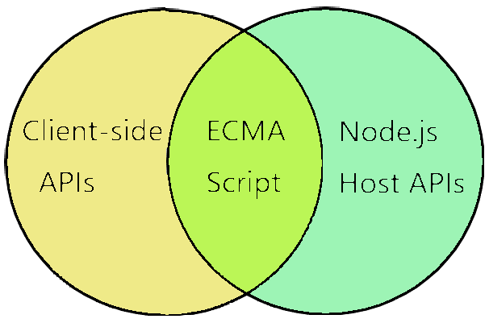
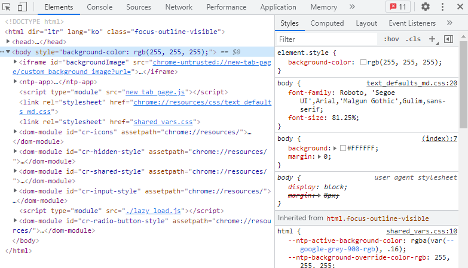

# 모던 자바스크립트 Deep Dive
* 자바스크립트를 더 깊게 공부하며 더 활용하자.
* 책을 읽으며 중요하다고 생각한 부분과 내가 다시 볼 부분을 정리하자.

## 목차
* [1장 프로그래밍](#1장-프로그래밍)
* [2장 자바스크립트란?](#2장-자바스크립트란)
* [3장 자바스크립트 개발 환경과 실행 방법](#3장-자바스크립트-개발-환경과-실행-방법)
* [4장 변수](#4장-변수)
* [5장 표현식과 문](#5장-표현식과-문)
* [more](./readme2.md)
## 1장 프로그래밍

### 1-1 프로그래밍이란?
* 컴퓨터에게 실행을 요구하는 일종의 커뮤니케이션이다.
  * 프로그래밍에 앞서 해결해야 할 문제를 명확히 이해한 후 적절한 문제 해결 방안을 정의해야 한다.
  * 이때 문제 해결 능력이 요구 된다.
  * 문제 해결 능력은 복잡함을 단순하게 분해하고 자료를 정리하고 구분해서 순서에 맞게 배열해야한다.

* 결국 프로그래밍이란?
  * 기계가 실행할 수 있을 정도로 정확하고 상세하게 요구사항을 설명하는 작업이며, 그 결과물은 코드이다.

### 1-2 프로그래밍 언어
* 문제해결 방안은 컴퓨터에게 전달되어야 한다.
  * 이때 기계어로 명령을 전달해야 한다.
* 기계어로 명령을 전달하는 대신할 대안은 문법으로 구성된 프로그래밍 언어를 사용해 프로그램을 작성한 후, 기계어로 변환하는 번역기를 이용하는 것이다.
  * 이러한 번역기를 컴파일러 혹은 인터프리터라고 한다.

* 프로그래밍은 프로그래밍 언어를 사용해 컴퓨터에게 실행을 요구하는 커뮤니케이션이다.
* 프로그래밍 언어는 구문과 의미의 조합으로 표현된다.

### 1-3 구문과 의미
* 아래 예제를 보자
```js
const number = 'string';
console.log(number * number); // NaN (Not a Number)
```
* 이 예제는 문법적으로는 문제가 없지만 의미적으로는 옳지 않다.
* 결국 코드는 해결 방안의 구체적 구현물이기 때문에, 문법에 부합하는 것은 물론이고 수행하고 싶은 것을 정확히 수행해야 한다.
* 즉 요구사항이 실현되어야 한다.

* 결국 프로그래밍은 요구사항의 집합을 분석해서 적절한 자료구조와 함수의 집합으로 변환한 후, 그 흐름을 제어하는 것이다.

## 2장 자바스크립트란?

### 2-1 자바스크립트의 탄생
* 1995년 넷스케이프 커뮤니케이션즈는 브라우저에서 동작하는 경량 프로그래밍 언어를 도입하기로 결정한다.
  * 이 때 탄생한 것이 브렌던 아키그가 개발한 자바스크립트이다.
* 자바스크립트는 1996년 3월 넷스케이프 내비게이터2에 탑재되었으며 모카로 명명 되었다.
  * 그해 9월 라이브스크립트로 이름이 바뀌었다가 12월에 드디어 자바스크립트라는 이름을 갖는다.
* 자바스크립트가 탄생한 뒤 얼마 지나지 않아 자바스크립트의 파생 버전인 JScript가 출시되어 자바스크립트는 위기를 맞는다.

### 2-2 자바스크립트의 표준화
* 1996년 8월, 마이크로소프트가 JScript를 IE 3.0에 탑재했다.
  * 이 때 JScript와 자바스크립트가 표준화되지 못하고 적당히 호환되었다.
  * 즉, 넷스케이프와 MS가 자사 브라우저의 점유율을 높이기 위해 자사 브라우저에서만 동작하는 기능을 추가했다.
* 이로 인하여 브라우저에 따라 웹페이지가 정상적으로 동작하지 않는 크로스 브라우징 이슈가 발생했다.
  * 결과적으로 모든 브라우저에서 정상적으로 동작하는 웹페이지를 개발하기가 무척 어려워졌다.
* 이에 자바스크립트의 파편화를 방지하고 표준화된 자바스크립트의 필요성이 대두되었다.
* 1996년 11월 넷스케이프에서 컴퓨터 시스템의 표준을 관리하는 ECMA 인터네셔널에 자바스크립트 표준화를 요청했다.
* 1997년 7월 표준화된 자바스크립트 초판이 나왔고 상표권 문제로 자바스크립트는 ECMAScript로 명명 되었다.

### 2-3 자바스크립트 성장과 역사
* 초창기 자바스크립트는 웹페이지의 보조적인 기능을 수행하기 위해 한정적인 용도로 사용되었다.
* 이 시기의 대부분 로직은 웹 서버에서 실행되었고, 브라우저는 전달받은 HTML과 CSS를 렌더링 하는 수준이었다.

#### 렌더링
```
렌더링이랑 HTML, CSS, 자바스크립트로 작성된 문서를 해석해서 브라우저에 시각적으로 출력하는 것을 말한다.
때로는 서버에서 데이터를 HTML로 변환해서 브라우저에 전달하는 과정인 SSR을 가리키기도 한다.
```

#### 2-3-1 Ajax
* 1999년 자바스크립트를 사용해 서버와 브라우저가 비동기 방식으로 데이터를 교환할 수 있는 통신 기능인 Ajax가 XMLHttpRequest라는 이름으로 등장했다.
* 이전의 웹페이지는 완전한 HTML 코드를 서버로부터 전송받아 웹페이지 전체를 렌더링하는 방식으로 동작했다. 따라서 화면이 전환되면 처음부터 렌더링했다.
* 이러한 방식은 변경할 필요가 없는 것까지 변경해서 성능이 떨어졌다.
* Ajax의 등장으로 서버로부터 필요한 데이터만 받아 변경이 필요한 부분만 렌더링하는 방식이 가능해졌다.

#### 2-3-2 jQuery
* 2006년 jQuery의 등장으로 DOM을 더욱 쉽게 제어할 수 있게 되며, 크로스 브라우징 이슈도 어느정도 해결되었다.
* 사용자 층이 순식간에 늘어났으며, 더 쉬운 jQuery를 더 선호하는 개발자가 양산되기도 했다.

#### 2-3-3 V8 자바스크립트 엔진
* 자바스크립트의 가능성이 확인되고 빠르게 동작하는 자바스크립트 엔진의 필요성이 대두되었다.
* 2008년 구글이 보여준 V8 자바스크립트 엔진은 빠른 성능을 보여주었다.
* V8 엔진의 등장으로 자바스크립트는 데스크탑 애플리케이션과 유사한 사용자 경험(UX)를 제공할 수 있는 웹 애플리케이션 프로그래밍 언어로 정착하게 되었다.
* V8 자바스크립트 엔진을 통한 자바스크립트의 발전으로 과거의 로직들이 대거 클라이언트로 이동했다.
* 이는 현재 프론트엔드 영역이 주목받는 계기로 작동했다.

#### 2-3-4 Node.js
* 2009년 라이언 달이 발표한 Node.js는 구글 V8 엔진으로 빌드된 자바스크립트 런타임 환경이다.
* Node.js는 브라우저의 엔진에서만 동작하던 자바스크립트를 브라우저 이외의 환경에서도 동작할 수 있도록 엔진을 독립시킨 js 실행 환경이다.
* Node.js는 다양한 플랫폼에 적용할 수 있지만, 주로 서버 사이드 애플리케이션 개발에 사용되며 내장 API를 제공한다.
* Node.js는 비동기 I/O를 지원하며 단일 스레드 이벤트 루프 기반으로 동작함으로써 요청 처리 성능이 좋다.
* SPA에 적합하다. 하지만 CPU 사용률이 높은 애플리케이션에는 권장하지 않는다.
* Node.js의 등장으로 js는 브라우저, 서버 사이드 개발에서도 사용할 수 있게 되었다.
* 프론트, 백 모두 사용이 가능하며, 웹 프로그래밍 언어의 표준으로 자리 잡고있다.
* js는 크로스 플랫폼을 위한 가장 중요한 언어로 주목받고 있다.
* js는 세계에서 가장 인기 있는 언어이다.

#### 2-3-5 SPA 프레임워크
* 이전의 개발 방식으로는 복잡해진 개발 과정을 수행하기 어려워졌다.
* CBD 방법론을 기반으로 하는 SPA가 대중화되었다.
* Angular, React, Vue.js, Svelte 등 다양한 프레임워크가 등장했다.

### 2-4 자바스크립트와 ECMAScript
* ECMAScript는 js의 표준 사양인 ECMA-262를 말하며, 프로그래밍 언어의 값, 타입, 객체와 프로퍼티, 함수, 표준 빌트인 객체 등 핵심 문법을 규정한다.
* 각 브라우저 제조사는 ECMAScript 사양을 준수해서 브라우저 내장 js 엔진을 구현한다.
* js는 일반적으로 ECMAScript가 뼈대를 이루며 브라우저가 별도 지원하는 클라이언트 사이드 Web API 등을 아우르는 개념이다.

### 2-5 자바스크립트의 특징
* js는 웹을 구성하는 요소중 하나이며 웹 브라우저에서 동작하는 유일한 프로그래밍 언어이다.
* 셀프에서는 프로토타입 기반 상속을, 스킴에서는 일급함수의 개념을 차용했다.
* 자바스크립트는 개발자가 별도의 컴파일 작업을 수행하지 않는 인터프리터 언어이다.
* 인터프리터는 소스코드를 즉시 실행하고 컴파일러는 빠르게 동작하는 머신 코드를 생성하고 최적화 한다.
* js는 명령형, 함수형, 프로토타입 기반 객체지향 프로그래밍을 지원하는 멀티 패러다임 프로그래밍 언어이다.
* js는 프로토타입 기반의 객체지향 언어이다.

### 2-6 ES6 브라우저 지원 현황
* IE를 제외한 대부분의 모던 브라우저는 ES6를 지원한다.
* Node.js는 v4부터 지원하기 시작했다.
* 브라우저에서 아직 지원하지 않는 최신 기능이나 구형 브라우저 같은 경우 바벨과 같은 트랜스파일러를 사용해 ES6이상의 사양으로 구현한 코드를 ES5 이하로 다운그레이드할 수 있다.

## 3장 자바스크립트 개발 환경과 실행 방법
### 3-1 자바스크립트 실행 환경
* 모든 브라우저와 Node.js는 자바스크립트 엔진을 내장하고 있다.
* 그러므로 브라우저에서 동작하는 코드는 Node에서도 동일하게 동작한다.
* 하지만 둘의 용도는 다르다.
* 그러므로 js 이외의 추가로 제공하는 각각의 기능은 호환되지 않는다.
* 예를 들어, 브라우저는 DOM API를 기본적으로 제공한다. 하지만 Node.js는 DOM API를 제공하지 않는다.
* 반대로 Node에서는 파일 시스템을 기본 제공하지만 브라우저는 이를 지원하지 않는다.
* 브라우저는 클라이언트 사이드 Web API를 지원하고, Node는 js와 Node 고유의 API를 지원한다.


### 3-2 웹 브라우저
* 앞으로의 예제에서는 구글 크롬을 사용한다.

#### 3-2-1 개발자 도구
* 크롬 브라우저가 제공하는 개발자 도구는 강력한 도구이다.
* 개발자 도구는 단축키로 열 수 있다.
```
윈도우: F12 또는 Ctrl + Shift + i
macOS: command + option + i
```

```
패널              설명
Elements: 로딩된 페이지의 DOM과 CSS를 편집해서 렌더링된 뷰를 확인할 수 있다.
Console: 로딩된 페이지의 에러를 확인하거나 js 소스코드의 console.log 메서드의 실행결과를 볼 수 있다.
Sources: 로딩된 페이지의 js 코드를 디버깅 할 수 있다.
Network: 로딩된 페이지의 관련된 request 정보와 성능을 확인할 수 있다.
Application: 웹 스토리지, 세션, 쿠키를 확인 및 관리할 수 있다.
```
#### 3-2-2 콘솔
* 콘솔은 js 코드에서 에러가 났을때 가장 우선적으로 보아야한다.
* console.log 메서드를 사용하는 경우도 봐야한다.
* 콘솔은 js 코드를 직접 입력해 결과를 확인하는 REPL(Read Eval Print Loop: 입력 수행 출력 반복) 환경으로 사용도 가능하다.
* js 코드 실행중 에러가 발생하면 에러의 내용이 콘솔에 출력된다.

#### 3-2-3 브라우저에서 자바스크립트 실행
* 브라우저는 HTML 파일을 로드하면 script 태그에 포함된 js 코드를 실행한다.
* [예제](./03/03-01.html)
* '+' 또는 '-' 버튼을 클릭하면 에러가 발생한다.
* 개발자 도구 콘솔로 확인이 가능하다.

#### 3-2-4 디버깅
* [](./images/03/3.PNG)
* 에러가 난 곳의 링크를 클릭하면 디버깅할 수 있는 Sources 패널로 이동한다.
* 에러가 발생한 곳의 빨간 밑줄이 표시되며, 에러 정보가 표시된다.
* 에러가 난곳을 찾고 바꿔보자.
  * 13번째 줄의 counter-x를 counter로 바꾸면 된다.

### 3-3 Node.js
* 규모가 큰 웹 어플리케이션을 개발할 때 React, Angular, Lodash같은 프레임워크와 라이브러리를 사용한다.
* 이때 Node.js와 npm이 필요하다.

#### 3-3-1 Node.js와 npm 소개
* Node.js는 크롬 V8 js 엔진으로 빌드된 js 런타임 환경이다.
* **npm**은 js 패키지 매니저다.
  * Node.js에서 사용할 수 있는 모듈들을 패키지화해서 모아둔 저장소 역할과 패키지 설치 및 관리를 위한 CLI를 제공한다.

#### 3-3-2 Node.js 설치
* <https://github.com/12tndbs12/node.js/tree/master/ch01#4-1-%EB%85%B8%EB%93%9C-%EC%84%A4%EC%B9%98%ED%95%98%EA%B8%B0/> 를 참고하자

#### 3-3-3 Node.js REPL
* Node.js가 제공하는 REPL을 사용하면 간단한 js 코드를 실행하고 결과를 확인할 수 있다.
* 터미널에서 아래와 같은 명령어 실행
```
$ node
```
* 프롬프트가 >로 변경되면 js 코드 입력
* js 파일을 실행하려면 node 명령어 뒤에 파일 이름 입력
```
$ node index.js
```
* Ctrl + C 키를 두번 입력하면 종료

### 3-4 비주얼 스튜디오 코드
#### 3-4-1 비주얼 스튜디오 코드 설치
* <https://code.visualstudio.com/> 에 접속 후 설치
#### 3-4-2 내장 터미널
* VS Code 실행후, js 파일을 생성하자.
```js
// index.js
const arr = [1,2,3];

arr.foreach(console.log);
```
* ctrl + ` 키로 터미널을 열 수 있다.
```
> node index.js
```
#### 3-4-3 Code Runner 확장 플러그인
* VS Code 마켓플레이스에서 다양한 확장 플러그인을 다운 가능하다.
* 클라이언트 사이드 Web API 는 Node.js 환경에서 실행할 수 없다.

#### 3-4-4 Live Server 확장 플러그인
* Web API가 포함된 js 코드를 실행하려면 브라우저에서 실행해야 한다.
* 이를 위해 Live Server라는 플러그인을 설치해주자.

## 4장 변수
### 4-1 변수란? 왜 필요한가
* 애플리케이션은 데이터를 입력 받고 출력한다.
* 변수는 언어에서 데이터를 관리하기 위한 개념이다.
* 메모리는 데이터를 저장할 수 있는 메모리 셀의 집합체다.
* 셀 하나의 크기는 1바이트이다.
* 1바이트 단위로 데이터를 저장하거나 읽어 들인다.

* 각 셀은 고유의 메모리 주소를 갖는다. 0부터 시작해서 메모리의 크기만큼 정수로 표현된다.
* 모든 데이터는 2진수로 저장된다.
* js는 개발자가 직접 메모리 제어를 할 수 없다.
* 변수는 하나의 값을 저장하기 위해 확보한 메모리 공간 자체 또는 메모리 공간을 식별하기 위해 붙인 이름이다.
* 변수는 값의 위치를 가리키는 상징적인 이름이다.
```
var result = 10 + 20;
1. 10 + 20을 통해 30을 생성한다.
2. 30을 메모리 안에 담는다.
3. result는 30이 담겨있는 메모리 주소를 가리킨다.
```
* 위 예제에서 result를 변수 이름이라고 하며, 30은 변수 값이라고 한다.
* 변수에 값을 저장하는 것을 **할당**, 변수에 저장된 값을 읽는 것을 **참조**라 한다.

### 4-2 식별자
* 변수 이름을 식별자라고도 한다.
* 식별자는 어떤 값을 구별해서 식별할 수 있는 고유한 이름이다.
* 식별자는 값이 아니라 메모리 주소를 기억하고 있다.
* 메모리 상에 존재하는 어떤 값을 식별할 수 있는 이름은 모두 식별자이다.
* 변수, 함수, 클래스 등과 같은 식별자는 네이밍 규칙을 준수해야 하며, 선언에 의해 js 엔진에 식별자의 존재를 알린다.

### 4-3 변수 선언
* 변수 선언이란 변수를 생성하는 것이다.
* 변수를 사용하려면 반드시 선언이 필요하다.
* 선언시 var, let, const 키워드를 사용한다.
```js
// 변수 이름을 등록하고 저장할 메모리 공간 확보
// 이 메모리 공간은 js 엔진에 의해 undefined라는 값이 할당되고 초기화된다.
var score;
```
* js 엔진은 변수 선언을 2단계에 걸쳐 수행한다.
  * 선언 단계: 변수 이름을 등록 후 js 엔진에 변수 존재를 알린다.
  * 초기화 단계: 메모리 공간을 확보하고 암묵적으로 undefined를 할당해 초기화한다.
* var 키워드로 선언한 변수는 기본적으로 undefined라는 값을 갖는다.
* 모든 식별자(변수, 함수, 클래스 등)를 사용하기 위해선 선언이 필수적이다.

### 4-4 변수 선언의 실행 시점과 변수 호이스팅
```js
console.log(score); // undefined

var score;  // 변수 선언문
```
* js 코드는 인터프리터에 의해 한줄씩 실행된다.
* 참조 에러가 일어나지 않고 undefined가 출력된다.
* 이유는, 변수 선언이 런타임 이전 단계에서 먼저 실행되기 때문이다.
* js 엔진은 변수 선언을 포함한 모든 선언문을 소스코드에서 찾고 먼저 실행한다. 그 다음 소스코드를 한 줄씩 실행한다.
* 이처럼 변수 선언문이 코드의 선두로 끌어 올려진 것처럼 동작하는 js 특징을 변수 호이스팅이라고 한다.

### 4-5 값의 할당
* 변수에 값을 할당 할 때 할당 연산자 =를 사용한다.
```js
var score;  // 변수 선언
score = 80; // 변수 할당
------------------------
// 위를 한줄로 줄이면
var score = 80;
```
* js 엔진은 단축 표현해도 선언과 할당을 2개의 문으로 나누어 실행한다.
```js
console.log(score); // undefined

var score;          //  1. 변수 선언
score = 80;         //  2. 값의 할당

console.log(score); // 80
```
* 변수 선언 (score = undefined) -> 값 할당(score = 80)
* 이 때 메모리 공간을 지우고 그 메모리 공간에 80을 저장하는게 아닌, 새로운 메모리 공간을 확보한다.

### 4-6 값의 재할당
* 재할당이란 이미 값이 할당되어 있는 변수에 새로운 값을 다시 할당하는 것이다.
```js
var score = 80;
score = 90;
```
* var 키워드 변수는 재할당 가능.
* 값을 재할당할 수 없다면 변수가 아니라 상수이다.
* const 키워드를 사용하면 재할당 불가능
* 현재 score는 90이며 이전 값인 undefined와 80은 필요없는 값이다.
* 이런 값들은 가비지 콜렉터에 의해 메모리에서 자동 해제된다. (예측 불가능)

### 4-7 식별자 네이밍 규칙
* 식별자는 아래와 같은 네이밍 규칙을 준수해야 한다.
  * 식별자는 특수문자를 제외한 문자, 숫자, _, $를 포함할 수 있다.
  * 단, 식별자는 특수문자를 제외한 문자, _, $로 시작해야 하며, 숫자로 시작하는 것은 허용하지 않는다.
  * 예약어는 식별자로 사용할 수 없다.
* 네이밍을 할때 가독성이 좋게쓰자. 또한 대부분 알파벳을 권장한다.

## 5장 표현식과 문
* 개념을 이해한다는 것은 용어를 정확히 이해하고 설명할 수 있다는 것이다.
### 5-1 값
* 값은 식(표현식)이 평가되어 생성된 결과를 말한다.
  * 평가란 식을 해석해서 값을 생성하거나 참조하는 것이다.
* 모든 값은 데이터 타입을 가지며, 메모리에 2진수의 나열로 저장된다.
```js
// sum 은 10 + 20이 할당되는게 아닌 30이 할당된다.
var sum = 10 + 20;
```
* 값은 여러 방법으로 생성이 가능하다.
* 가장 기본적인 방법은 리터럴을 사용하는 것이다.

### 5-2 리터럴
* 리터럴은 사람이 이해할 수 있는 문자 또는 약속된 기호를 사용해 값을 생성하는 표기법을 말한다.
```js
// 숫자 리터럴 3
3
```
* 위 숫자는 아라비아 숫자가 아니라 숫자 리터럴이다.
* 사람이 이해하는 아라비아 숫자를 사용해 숫자 리터럴 3을 코드에 사용하면 js 엔진은 이를 평가해서 숫자 값 3을 생성한다.
* js 엔진은 런타임에 리터럴을 평가해 값을 생성한다.
* 리터럴을 값을 생성하기 위해 미리 약속한 표기법이다.

### 5-3 표현식
* 표현식은 값으로 평가될 수 있는 문이다. 표현식이 평가되면 새로운 값을 생성하거나 기존 값을 참조한다.
```js
// 100은 리터럴이다.
var score = 100;
---------------------
// 50 + 50은 리터럴과 연산자이며 평가되어 100을 생성하는 표현식이다.
var a = 50 + 50;
---------------------
score;  // 100
```
* 변수 식별자를 참조하면 변수 값으로 평가된다.
* 식별자 참조는 값으로 평가되며 표현식이다.
* 값으로 평가될 수 있는 문은 모두 표현식이다.
* 표현식은 다른 표현식의 일부가 되어 새로운 값을 만들 수 있다.

### 5-4 문
* 문(statement)와 표현식을 구별하고 해석할 수 있다면 js 엔진 입장에서 코드를 읽으며 실행 결과를 예측하는데 도움이 된다.
* 문은 프로그램을 구성하는 기본 단위이자 최소 실행 단위다.
  * 문의 집합이 프로그램이며, 문을 작성하고 순서에 맞게 나열하는 것이 프로그래밍이다.
* 문은 여러 토큰으로 구성된다.
  * 토큰이란 문법적인 의미를 가지고, 문법적으로 더 이상 나눌 수 없는 코드의 기본 요소를 의미한다.
  * 명령문이라고도 부른다.
```js
// var, sum, =, 1, +, 2, ; 모두 각각의 토큰이다.
// 아래 문장 전체가 한 문이다.
var sum = 1 + 2;
```

### 5-5 세미콜론과 세미콜론 자동 삽입 기능
* 세미콜론( ; )은 문의 종료를 나타낸다.
* 0개 이상의 문을 중괄호로 묶은 코듣 블록 뒤에는 세미콜론을 붙이지 않는다.
  * if문, for문, 함수 등의 코드
  * 이러한 코드 블록은 자체 종결성을 갖는다.
* 세미콜론은 생략이 가능하다.
  * 세미콜론 자동 삽입 기능이 수행되기 떄문이다.
* 하지만 개발자의 예측과 항상 일치하지 않으니 붙이는 습관을 들이자.

### 5-6 표현식인 문과 표현식이 아닌 문
```js
// 변수 선언문은 값으로 평가될 수 없으므로 표현식이 아니다.
var x;
// 아래는 표현식이면서 문이다.
x = 1 + 2;
```
* **표현식인 문과 표현식이 아닌 문을 구별하는 간단한 방법은 변수에 할당해 보는 것이다.**
```js
var foo = var x;  // 에러
--------------------------
var foo = x = 100; // 성공
```