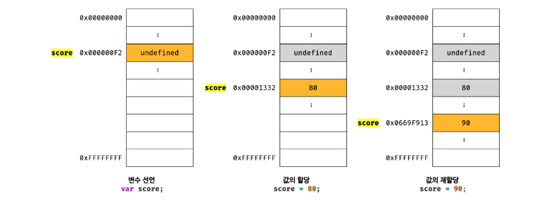
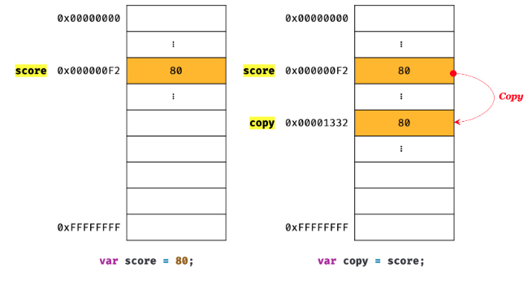
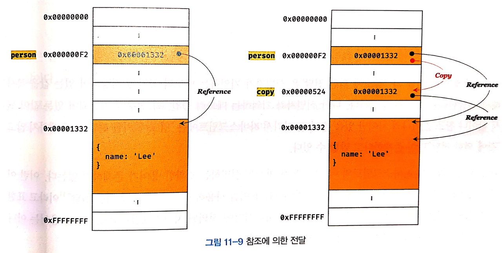
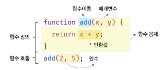
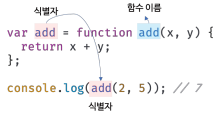

# 모던 자바스크립트 Deep Dive

## 목차
* [11장 원시 값과 객체의 비교](#11장-원시-값과-객체의-비교)
* [12장 함수]()
* [13장 스코프]()
* [14장 전역 변수의 문제점]()
* [15장 let, const 키워드와 블록 레벨 스코프]()
* [more](./readme4.md)

## 11장 원시 값과 객체의 비교
* js의 7가지 데이터 타입은 크게 원시 타입과 객체 타입으로 구분할 수 있다.
* 원시 타입과 객체 타입의 차이점
  * 원시 값은 변경 불가능한 값이다. 객체는 변경 가능한 값이다.
  * 원시 값을 변수에 할당하면 변수에는 실제 값이 저장된다. 객체를 변수에 할당하면 변수에는 참조 값이 저장된다.
  * 원시 값을 갖는 변수를 다른 변수에 할당하면 원시 값이 복사되어 전달된다. 이를 값에 의한 전달이라 한다.
  * 이에 비해 객체를 가리키는 변수를 다른 변수에 할당하면 원본의 참조 값이 복사되어 전달된다. 이를 참조에 의한 전달이라 한다.

### 11-1 원시 값
#### 11-1-1 변경 불가능한 값
* 원시 타입의 값, 즉 원시 값은 변경 불가능한 값이다.
* 한번 생성된 원시값은 읽기 전용 값이다.
* 변경이 불가능하다는 것은 변수가 아니라 값에 대한 진술이다.
* 원시 값 자체를 변경할 수 없고, 변수 값은 변경이 가능하다.

* 원시 값을 재할당하면 새로운 메모리 공간을 확보하고 재할당한 값을 저장한 후, 변수가 참조하던 메모리 공간의 주소를 변경한다. 이러한 특성을 **불변성**이라고 한다.
* 불변성을 갖는 원시 값을 할당한 변수는 재할당 이외의 변수 값을 변경할 수 있는 방법이 없다.

#### 11-1-2 문자열과 불변성
* 문자열은 1개의 문자당 2바이트이다.
* 문자열은 유사 배열 객체이면서 이터러블이다.
> 유사 배열 객체: 배열처럼 인덱스로 프로퍼티값에 접근할 수 있고 length 프로퍼티를 갖는 객체를 말한다.
```js
var str = 'string';
// 문자열은 유사 배열이므로 인덱스로 각 문자에 접근 가능
// 문자열은 원시값이므로 변경 불가능. 에러가 발생하지 않는다.
str[0] = 'S';
        // str = string;
```
* 위 예시처럼 일부 문자를 변경해도 반영되지 않는다.
* 데이터의 신뢰성을 보장한다.

#### 11-1-3 값에 의한 전달
```js
var score = 80;
var copy = score;

console.log(score);   // 80
console.log(copy);    // 80

score = 100;

console.log(score);   // 100
console.log(copy);    // 80
```
* 이 문제의 핵심은 변수에 변수를 할당하면 무엇이 어떻게 전달되는가 이다.
* 변수에 원시 값을 갖는 변수를 하라당하면 할당받는 변수에는 할당되는 변수의 원시 값이 복사되어 전달된다.
  * 이를 **값에 의한 전달**이라고 한다.
* score와 copy는 같은 값이지만 각각 변수의 값 80은 다른 메모리 공간에 저장된 별개의 값이다.

* 따라서 score변수의 값을 변경해도 copy 변수의 값에는 영향을 주지 않는다.
* 엄격하게 표현하면 변수에는 값이 전달되는 것이 아니라 메모리 주소가 전달된다. 이는 변수와 같은 식별자는 값이 아니라 메모리 주소를 기억하고 있기 때문이다.
* 값의 의한 전달도 사실은 값을 전달하는 것이 아니라 메모리 주소를 전달한다. 단, 전달된 메모리 주소를 통해 메모리 공간에 접근하면 값을 참조할 수 있다.
* 두 변수의 원시 값은 서로 다른 메모리 공간에 저장된 별개의 값이 되어 어느 한쪽에서 재할당을 통해 값을 변경해도 서로 간섭할 수 없다.

### 11-2 객체
* 객체는 프로퍼티의 개수가 정해져 있지 않고, 동적으로 추가되고 삭제할 수 있다. 프로퍼티 값에도 제약이 없다.
* 객체는 원시 값과는 다른 방식으로 동작한다.

#### 11-2-1 변경 가능한 값
* 객체 타입의 값, 객체는 변경 가능한 값이다.
* 원시 값을 할당한 변수는 원시 값 자체를 값으로 갖는다.
* 객체를 할당한 변수가 기억하는 메모리 주소를 통해 메모리 공간에 접근하면 참조 값에 접근할 수 있다.
  * 참조 값은 생성된 객체가 저장된 메모리 공간의 주소이다.

* 객체를 할당한 변수는 재할당 없이 객체를 직접 변경할 수 있다.
* 재할당 없이 프로퍼티를 동적으로 추가할 수 있고, 갱신할 수 있고, 삭제할 수 있다.
* 객체는 여러 개의 식별자가 하나의 객체를 공유할 수 있다.
> 얕은 복사와 깊은 복사
  * 객체를 프로퍼티 값으로 갖는 객체의 경우 얕은 복사는 한 단계까지만 복사하는 것을 말한다.
  * 깊은 복사는 객체에 중첩되어 있는 객체까지 모두 복사하는 것을 말한다.
  ```js
  const o = { x: { y: 1}};

  // 얕은 복사
  const c1 = { ...o };
  console.log(c1 === o);  // false
  console.log(c1.x === o.x);  // true

  // lodash의 cloneDeep을 사용한 깊은 복사
  const _ = require('lodash');

  // 깊은 복사
  const c2 = _.cloneDeep(o);
  console.log(c1 === o);  // false
  console.log(c1.x === o.x);  // false
  ```
  * 얕은 복사와 깊은 복사로 생성된 객체는 원본과는 다른 객체다.
  * 얕은 복사는 참조 값을 복사하고 깊은 복사는 객체까지 모두 복사해서 완전한 복사본을 만든다.

#### 11-2-2 참조에 의한 전달
* 객체를 가리키는 변수를 다른 변수에 할당하면 원본의 참조 값이 복사되어 전달된다. 이를 참조에 의한 전달이라고 한다.
```js
var person = {
  name: 'Lee',
};

// 얕은 복사
var copy = person;
```

* 위의 예시에서 두 개의 식별자가 하나의 객체를 공유한다는 것을 의미한다.
* 어느 한쪽에서 객체를 변경하면 서로 영향을 주고받는다.

```js
var person = {
    name: 'Lee'
};
 
// 얕은 복사, copy와 persone은 동일한 참조 값을 가진다.
var copy = person;

console.log(person === copy);  // true
 
// 분명 person의 name property만 수정했지만 copy의 출력 결과도 변했다.
person.name = 'Kim';
console.log(person, copy);  // { name: 'Kim' } { name: 'Kim' }
```
* 값에 의한 전달과 참조에 의한 전달은 식별자가 기억하는 메모리 공간에 저장되어 있는 값을 복사해서 전달한다는 면에서는 동일하다.
* js는 참조에 의한 전달은 존재하지 않고 값에 의한 전달만이 존재한다.

## 12장 함수
### 12-1 함수란?
* 함수는 js에서 가장 중요한 핵심 개념이다.
* 수학의 함수는 입력을 받아 출력을 내보내는 과정을 정의한 것이다.
* 프로그래밍 언어의 함수도 수학의 함수와 같은 개념이다.
  * 프로그래밍 언어의 함수는 일련의 과정을 문으로 구현하고 코드 블록으로 감싸서 하나의 실행 단위로 정의한 것이다.
  * 함수 내부로 입력을 전달받는 변수를 매개변수, 입력을 인수, 출력을 반환값이라고 한다.
  * 함수는 값이다.
  * 
* 함수는 함수 정의를 통해 생성한다.
* 함수는 실행하는 것을 명시적으로 지시해야하며 이를 함수 호출이라고 한다.

### 12-2 함수를 사용하는 이유
* 코드의 재사용 측면에서 유용하다.
* 유지보수의 편의성을 높이며 코드의 신뢰성을 높인다.
* 코드의 가독성을 향상시킨다.

### 12-3 함수 리터럴
* js 함수는 객체 타입의 값이다.
* 함수도 함수 리터럴로 생성할 수 있다.
* 함수 리터럴은 function 키워드, 함수 이름, 매개 변수 목록, 함수 몸체로 구성된다.
```js
var f = function add(x, y) {
  return x + y;
}
```
* 함수리터럴의 구성 요소
  * 함수 이름
  * 매개변수 몰곩
  * 함수 몸체
* 함수는 객체다.
* 일반 객체는 호출할 수 없지만 함수는 호출할 수 있다.

### 12-4 함수 정의
* 함수 정의란 함수 호출 이전에 매개변수와 문, 반환할 값을 지정하는 것을 말한다.
* 함수 정의 방식
  * 함수 선언문
  * 함수 표현식
  * function 생성자 함수
  * 화살표 함수

#### 12-4-1 함수 선언문
```js
// 함수 선언문
function add(x, y) {
  return x + y;
}

// 함수 참조
console.dir(add);         // [Function: add] : Node.js 환경

// 함수 호출
console.log(add(2,5));    // 7
```
* 함수 선언문은 함수 이름을 생략할 수 없다.
* 함수 리터럴은 함수 이름을 생략할 수 있다.
* 함수 선언문은 표현식이 아닌 문이다.
* js 엔진은 생성된 함수를 호출하기 위해 함수 이름과 동일한 이름의 식별자를 암묵적으로 생성하고, 함수 객체를 할당한다.
* 함수는 함수 이름으로 호출하는 것이 아니라 함수 객체를 가리키는 식별자로 호출한다.


#### 12-4-2 함수 표현식
* 값의 성질을 갖는 객체를 일급 객체라고 하며, js의 함수는 일급 객체다.
* 함수 리터럴로 생성한 함수 객체를 변수에 할당 할 수 있으며, 이런 정의 방식을 함수 표현식이라고 한다.
```js
// 함수 표현식
var add = function (x, y) {
  return x + y;
}

console.log(add(2,5));    // 7
```

#### 12-4-3 함수 생성 시점과 함수 호이스팅
```js
console.dir(add);   // [Function: add]
console.dir(sub);   // undefined

console.log(add(2,5));  // 7
console.log(sub(2,5));  // TypeError: ~~~

// 함수 선언문
function add(x, y) {
  return x + y;
}

// 함수 표현식
var sub = function (x, y) {
  return x - y;
}
```
* 함수 선언문으로 정의한 함수는 이전에 호출 가능하다.
* 표현식은 불가능하다.
* 함수 선언문으로 정의한 함수와 함수 표현식으로 정의한 함수의 생성 시점이 다르기 때문이다.
* 이처럼 하수 선언문이 코드의 선두로 끌어 올려진 것처럼 동작하는 js 고유의 특징을 함수 호이스팅이라고 한다.
* 변수 할당문의 값은 할당문이 실행되는 시점, 런타임에 평가되므로 함수 표현식의 함수 리터럴도 할당문이 실행되는 시점에 평가되어 함수 객체가 된다.
* 함수 표현식으로 함수를 정의하면 함수 호이스팅이 발생하는 것이 아니라 변수 호이스팅이 발생한다.

#### 12-4-4 Function 생성자 함수
```js
var add = new Function('x', 'y', 'return x + y');
console.log(add(2,5));    // 7
```
* 권장하지 않는다.

#### 12-4-5 화살표 함수
* ES6에서 도입되었다.
* 화살표 함수는 항상 익명 함수로 정의한다.
```js
const add = (x, y) => x + y;
console.log(add(2,5));    // 7
```

### 12-5 함수 호출
* 함수는 식별자와 함수 호출 연산자로 호출한다.
#### 12-5-1 매개변수와 인수
* 함수를 실행하기 위해 필요한 값을 함수 외부에서 내부로 전달할 필요가 있는 경우, 매개변수를 통해 인수를 전달한다.
* 인수는 값으로 평가될 수 이는 표현식이어야 한다.
```js
// 함수 선언문
function add(x, y) {
  return x + y;
}
// 함수 호출
// 인수 1과 2를 매개변수 x와 y에 순서대로 할당후 실행
var result = add(1,2);
```
* 매개변수는 함수 몸체 내부에서만 참조할 수 있다.
* 인수가 부족해서 할당되지 않은 매개변수의 값은 undefined다.
* 인수가 더 많은 경우 초과된 인수는 무시된다.

#### 12-5-2 인수 확인
* js는 매개변수의 타입을 사전에 지정할 수 없다.
```js
function add(x, y) {
  if (typeof x !== 'number' || typeof y !== 'number') {
    throw new TypeError('인수는 모두 숫자 값이어야 한다.');
  }
  return x + y;
}
```
* 타입스크립트를 추천한다.

#### 12-5-3 매개변수의 최대 개수
* 적을수록 좋다.
* 이상적인 함수는 한 가지 일만 해야하며 가급적 작게 만들어야 한다.

#### 12-5-4 반환문
* 함수는 return 키워드와 표현식으로 이뤄진 반환문을 사용해 실행 결과를 함수 외부로 return 할 수 있다.
```js
function add(x, y) {
  return x + y; // 반환문
}
```
* 함수 호출은 표현식이다. return 키워드가 반환한 반환값으로 평가된다.
* 반환문의 두 가지 역할
  * 함수 실행을 중단하고 함수 몸체를 빠져나간다.
  * return 키워드 뒤에 오는 표현식을 평가해 반환한다. 지정하지 않으면 undefined를 반환한다.

### 12-6 참조에 의한 전달과 외부 상태의 변경
* 매개변수도 타입에 따라 값에 의한 전달, 참조에 의한 전달 방식을 그대로 따른다.
* 매개변수에 원시값을 넣으면 훼손되지 않는다.
* 매개변수에 객체를 넣으면 훼손된다.
* 이런 문제의 해결 방법 중 하나는 객체를 불변 객체로 만들어 사용하는 것이다.
* 외부 상태를 변경하지 않고 오부 상태에 의존하지도 않는 함수를 순수 함수라고 한다.

### 12-7 다양한 함수의 형태
#### 12-7-1 즉시 실행 함수
* 함수 정의와 동시에 즉시 호출되는 함수를 즉시 실행 함수라고 한다.
* 단 한번만 호출되며 다시 호출할 수 없다.
```js
// 익명 즉시 실행 함수
(function () {
    var a = 3;
    var b = 5;
    return a * b;
  }());
```
* 즉시 실행 함수는 반드시 그룹 연산자 ()로 감싸야 한다.

#### 12-7-2 재귀 함수
* 함수가 자기 자신을 호출하는 것을 재귀 호출이라고 한다.
```js
function countdown(n) {
  if(n < 0) return;
  console.log(n);
  countdown(n - 1); // 재귀 호출
}
countdown(10);
```
* 탈출 조건을 반드시 만들어야 한다. 그렇지 않으면 stack overflow 에러가 발생한다.

#### 12-7-3 중첩 함수
* 함수 내부에 정의된 함수를 중첩 함수 또는 내부 함수라고 한다.
* 이를 포함하는 함수를 외부 함수라고 한다.
```js
function outer() {
  var x = 1;
  // 중첩 하수
  function inner() {
    var y = 2;
    // 외부 함수의 변수를 참조할 수 있다.
    console.log(x + y);
  }
  inner();
}
outer();
```

#### 12-7-4 콜백 함수
* 함수의 매개변수를 통해 다른 함수의 내부로 전달되는 함수를 콜백 함수라고 한다.
* 매개 변수를 통해 함수의 외부에서 콜백 함수를 전달받은 함수를 고차 함수라고 한다.
* 고차 함수는 콜백 함수를 자신의 일부분으로 합성한다.
* 고차 함수는 매개변수를 통해 전달받은 콜백 함수의 호출 시점을 결정해서 호출한다.
* 콜백 함수는 고차 함수에 의해 호출되며 이때 고차 함수는 필요에 따라 콜백 함수에 인수를 전달할 수 있다.
```js
// 익명 함수 리터럴을 콜백 함수로 고차 함수에 전달
repeat(5, function (i) {
  if (i % 2) console.log(i);
});
```

#### 12-7-5 순수 함수와 비순수 함수
* 부수 효과가 없는 함수를 순수 함수, 부수 효과가 있는 함수를 비순수 함수라고 한다.
* 순수 함수는 동일하나 인수가 전달되면 언제나 동일한 값을 반환하는 함수다.
* 함수의 외부 상태를 변경하지 않는다.
```js
var count = 0;
// 순수함수
function increase(n) {
  return ++n;
}
count = increase(count);
```
* 외부 상태에 의존하는 함수는 비순수 함수이다.
```js
var count = 0;
// 비순수 함수
function increase() {
  return ++count;
}
increase();
```
* 순수 함수를 통해 부수 효과를 최대한 억제해서 오류를 피하고 프로그램의 안정성을 높이자.


