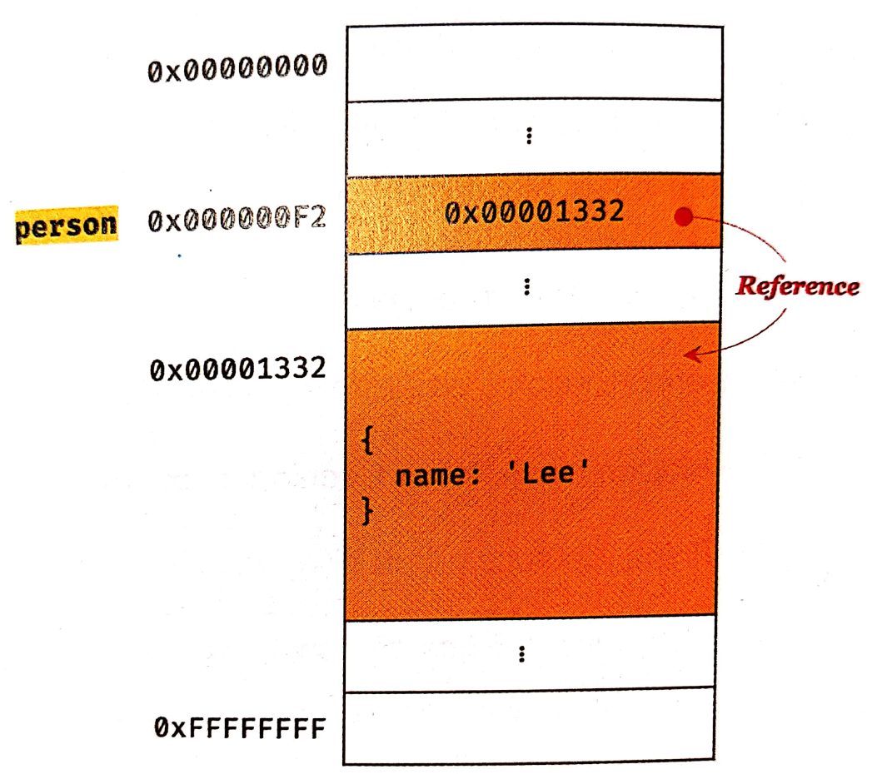

# 모던 자바스크립트 Deep Dive

## 목차
* [11장 원시 값과 객체의 비교]()
* [12장 함수]()
* [13장 스코프]()
* [14장 전역 변수의 문제점]()
* [15장 let, const 키워드와 블록 레벨 스코프]()
* [more](./readme4.md)

## 11장 원시 값과 객체의 비교
* js의 7가지 데이터 타입은 크게 원시 타입과 객체 타입으로 구분할 수 있다.
* 원시 타입과 객체 타입의 차이점
  * 원시 값은 변경 불가능한 값이다. 객체는 변경 가능한 값이다.
  * 원시 값을 변수에 할당하면 변수에는 실제 값이 저장된다. 객체를 변수에 할당하면 변수에는 참조 값이 저장된다.
  * 원시 값을 갖는 변수를 다른 변수에 할당하면 원시 값이 복사되어 전달된다. 이를 값에 의한 전달이라 한다.
  * 이에 비해 객체를 가리키는 변수를 다른 변수에 할당하면 원본의 참조 값이 복사되어 전달된다. 이를 참조에 의한 전달이라 한다.

### 11-1 원시 값
#### 11-1-1 변경 불가능한 값
* 원시 타입의 값, 즉 원시 값은 변경 불가능한 값이다.
* 한번 생성된 원시값은 읽기 전용 값이다.
* 변경이 불가능하다는 것은 변수가 아니라 값에 대한 진술이다.
* 원시 값 자체를 변경할 수 없고, 변수 값은 변경이 가능하다.

* 원시 값을 재할당하면 새로운 메모리 공간을 확보하고 재할당한 값을 저장한 후, 변수가 참조하던 메모리 공간의 주소를 변경한다. 이러한 특성을 **불변성**이라고 한다.
* 불변성을 갖는 원시 값을 할당한 변수는 재할당 이외의 변수 값을 변경할 수 있는 방법이 없다.

#### 11-1-2 문자열과 불변성
* 문자열은 1개의 문자당 2바이트이다.
* 문자열은 유사 배열 객체이면서 이터러블이다.
> 유사 배열 객체: 배열처럼 인덱스로 프로퍼티값에 접근할 수 있고 length 프로퍼티를 갖는 객체를 말한다.
```js
var str = 'string';
// 문자열은 유사 배열이므로 인덱스로 각 문자에 접근 가능
// 문자열은 원시값이므로 변경 불가능. 에러가 발생하지 않는다.
str[0] = 'S';
        // str = string;
```
* 위 예시처럼 일부 문자를 변경해도 반영되지 않는다.
* 데이터의 신뢰성을 보장한다.

#### 11-1-3 값에 의한 전달
```js
var score = 80;
var copy = score;

console.log(score);   // 80
console.log(copy);    // 80

score = 100;

console.log(score);   // 100
console.log(copy);    // 80
```
* 이 문제의 핵심은 변수에 변수를 할당하면 무엇이 어떻게 전달되는가 이다.
* 변수에 원시 값을 갖는 변수를 하라당하면 할당받는 변수에는 할당되는 변수의 원시 값이 복사되어 전달된다.
  * 이를 **값에 의한 전달**이라고 한다.
* score와 copy는 같은 값이지만 각각 변수의 값 80은 다른 메모리 공간에 저장된 별개의 값이다.

* 따라서 score변수의 값을 변경해도 copy 변수의 값에는 영향을 주지 않는다.
* 엄격하게 표현하면 변수에는 값이 전달되는 것이 아니라 메모리 주소가 전달된다. 이는 변수와 같은 식별자는 값이 아니라 메모리 주소를 기억하고 있기 때문이다.
* 값의 의한 전달도 사실은 값을 전달하는 것이 아니라 메모리 주소를 전달한다. 단, 전달된 메모리 주소를 통해 메모리 공간에 접근하면 값을 참조할 수 있다.
* 두 변수의 원시 값은 서로 다른 메모리 공간에 저장된 별개의 값이 되어 어느 한쪽에서 재할당을 통해 값을 변경해도 서로 간섭할 수 없다.

### 11-2 객체
* 객체는 프로퍼티의 개수가 정해져 있지 않고, 동적으로 추가되고 삭제할 수 있다. 프로퍼티 값에도 제약이 없다.
* 객체는 원시 값과는 다른 방식으로 동작한다.

#### 11-2-1 변경 가능한 값
* 객체 타입의 값, 객체는 변경 가능한 값이다.
* 원시 값을 할당한 변수는 원시 값 자체를 값으로 갖는다.
* 객체를 할당한 변수가 기억하는 메모리 주소를 통해 메모리 공간에 접근하면 참조 값에 접근할 수 있다.
  * 참조 값은 생성된 객체가 저장된 메모리 공간의 주소이다.

* 객체를 할당한 변수는 재할당 없이 객체를 직접 변경할 수 있다.
* 재할당 없이 프로퍼티를 동적으로 추가할 수 있고, 갱신할 수 있고, 삭제할 수 있다.
* 객체는 여러 개의 식별자가 하나의 객체를 공유할 수 있다.
> 얕은 복사와 깊은 복사
  * 객체를 프로퍼티 값으로 갖는 객체의 경우 얕은 복사는 한 단계까지만 복사하는 것을 말한다.
  * 깊은 복사는 객체에 중첩되어 있는 객체까지 모두 복사하는 것을 말한다.
  ```js
  const o = { x: { y: 1}};

  // 얕은 복사
  const c1 = { ...o };
  console.log(c1 === o);  // false
  console.log(c1.x === o.x);  // true

  // lodash의 cloneDeep을 사용한 깊은 복사
  const _ = require('lodash');

  // 깊은 복사
  const c2 = _.cloneDeep(o);
  console.log(c1 === o);  // false
  console.log(c1.x === o.x);  // false
  ```
  * 얕은 복사와 깊은 복사로 생성된 객체는 원본과는 다른 객체다.
  * 얕은 복사는 참조 값을 복사하고 깊은 복사는 객체까지 모두 복사해서 완전한 복사본을 만든다.

#### 11-2-2 참조에 의한 전달
* 객체를 가리키는 변수를 다른 변수에 할당하면 원본의 참조 값이 복사되어 전달된다. 이를 참조에 의한 전달이라고 한다.
```js
var person = {
  name: 'Lee',
};

// 얕은 복사
var copy = person;
```

* 위의 예시에서 두 개의 식별자가 하나의 객체를 공유한다는 것을 의미한다.
* 어느 한쪽에서 객체를 변경하면 서로 영향을 주고받는다.

```js
var person = {
    name: 'Lee'
};
 
// 얕은 복사, copy와 persone은 동일한 참조 값을 가진다.
var copy = person;

console.log(person === copy);  // true
 
// 분명 person의 name property만 수정했지만 copy의 출력 결과도 변했다.
person.name = 'Kim';
console.log(person, copy);  // { name: 'Kim' } { name: 'Kim' }
```
* 값에 의한 전달과 참조에 의한 전달은 식별자가 기억하는 메모리 공간에 저장되어 있는 값을 복사해서 전달한다는 면에서는 동일하다.
* js는 참조에 의한 전달은 존재하지 않고 값에 의한 전달만이 존재한다.

## 12장 함수