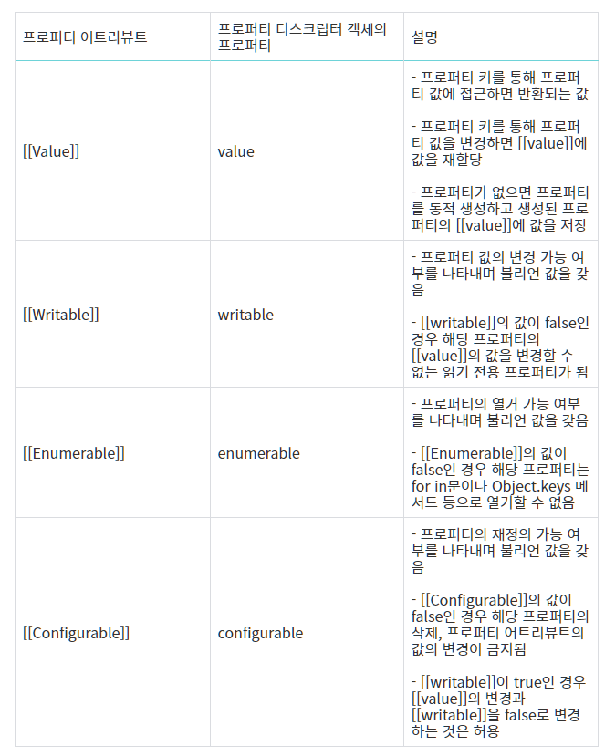
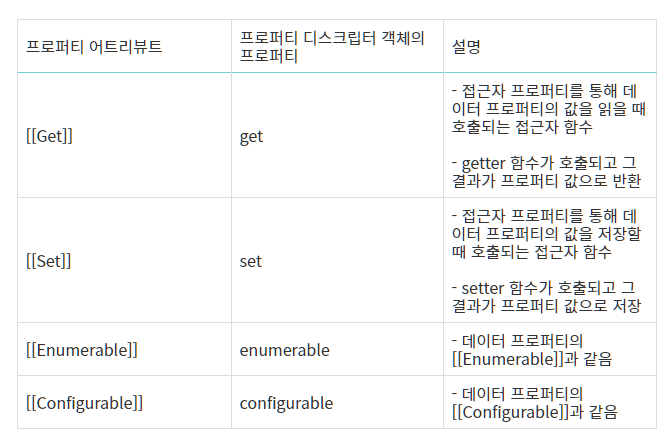

# 모던 자바스크립트 Deep Dive

## 목차
* [16장 프로퍼티 어트리뷰트](#16장-프로퍼티-어트리뷰트)
* [17장 생성자 함수에 의한 객체 생성](#17장-생성자-함수에-의한-객체-생성)
* [18장 함수와 일급 객체](#18장-함수와-일급-객체)
* [19장 프로토 타입](#19장-프로토-타입)
* [20장 strict mode](#20장-strict-mode)
* [more](./readme5.md)

## 16장 프로퍼티 어트리뷰트
### 16-1 내부 슬롯과 내부 메서드
* 내부 슬롯과 내부 메서드는 js 엔진 구현 알고리즘을 설명하기 위해 ECMAScript 사양에서 사용하는 의사 프로퍼티와 의사 메서드다.
* 내부 슬롯과 내부 메서드는 js 엔진에서 실제로 동작하지만 외부로 공개된 객체의 프로퍼티는 아니다.
* js 엔진의 내부 로직이며 원칙적으로는 직접 접근하거나 호출할 수 있는 방법을 제공하지 않는다.
* 일부 내부 슬롯과 내부 메서드에 한하여 간접적으로 접근할 수 있는 수단을 제공한다.
### 16-2 프로퍼티 어트리뷰트와 프로퍼티 디스크립터 객체
* js 엔진은 프로퍼티를 생성할 때 프로퍼티의 상태를 나타내는 프로퍼티 어트리뷰트를 기본값으로 자동 정의한다.
* 프로퍼티의 상태란 프로퍼티의 값, 값의 갱신 가능 여부, 열거 가능 여부, 재정의 가능 여부이다.
* 프로퍼티 어트리뷰트는 js 엔진이 관리하는 내부 상태 값인 내부 슬롯 ```[[value]], [[Writable]], [[Eumerable]], [[Configurable]]```이다.
```js
const person = {
  name: 'Lee',
};

// Object.getOwnPropertyDescriptor를 사용하여 간접적으로 확인 가능
// 프로퍼티 어트리뷰트 정보를 제공하는 프로퍼티 디스크립터 객체를 반환한다.
console.log(Object.getOwnPropertyDescriptor(person, 'name'));
// { value: 'Lee', writable: true, enumerable: true, configurable: true }
```
* Object.getOwnPropertyDescriptor 메서드는ㄴ 프로퍼티 디스크립터 객체를 반환한다.

### 16-3 데이터 프로퍼티와 접근자 프로퍼티
* 프로퍼티는 데이터 프로퍼티와 접근자 프로퍼티로 구분할 수 있다.
  * 데이터 프로퍼티 : 키와 값으로 구성된 일반적인 프로퍼티이다. 지금까지 살펴본 모드느 프로퍼티는 데이터 프로퍼티이다.
  * 접근자 프로퍼티 : 자체적으로 값을 갖지 않고 다른 데이터 프로퍼티의 값을 읽거나 저장할 때 호출되는 접근자 하마수로 구성된 프로퍼티다.

#### 16-3-1 데이터 프로퍼티
* 데이터 프로퍼티는 아래 표와 같은 프로퍼티 어트리 뷰트를 갖는다.
* 이 프로퍼티 어트리뷰트는 js 엔진이 프로퍼티를 생성할 때 기본값으로 자동 정의된다.


#### 16-3-2 접근자 프로퍼티
* 접근자 프로퍼티는 자체적으로는 값을 갖지 않고 다른 데이터 프로퍼티의 값으르 읽거나 저장할 때 사용하는 접근자 함수로 구성된 프로퍼티다.

* 접근자 함수는 getter/setter 함수라고도 부른다.
```js
const person = {
  firstName: "Ungmo",
  lastName: "Lee",

  // fullName은 접근자 함수롤 구성된 접근자 프로퍼티이다.
  // getter
  get fullName() {
    return `${this.firstName} ${this.lastName}`;
  },

  // setter
  set fullName(name) {
    [this.first, this.second] = name.split(" ");
  },
};

// 데이터 프로퍼티를 통한 프로퍼티 값의 참조.
console.log(person.firstName + ' ' + person.lastName);    // Ungmo Lee

// 접근자 프로퍼티를통한 프로퍼티 값의 저장
// fullName에 값을 저장하면 setter 호출
person.fullName = 'Heegun Lee';
console.log(person);

// 접근자 프로퍼티를 통한 프로퍼티 값의 참조
console.log(person.fullName);

// firstName은 데이터 프로퍼티이다.
// 프로퍼티 어트리뷰트를 갖는다
let descriptor = Object.getOwnPropertyDescriptor(person, 'firstName');
console.log(descriptor);
// { value: 'Ungmo', writable: true, enumerable: true, configurable: true }

// fullName은 데이터 프로퍼티이다.
// 프로퍼티 어트리뷰트를 갖는다
descriptor = Object.getOwnPropertyDescriptor(person, 'fullName');
console.log(descriptor);
// { get: [Function: get fullName], set: [Function: set fullName], enumerable: true, configurable: true }
```
* person 객체의 firstName과 lastName은 일반적인 데이터 프로퍼티이다.
* 메서드 앞에 get, set이 붙은 베서드가 getter/setter 함수이며, 함수의 ㅣ이름 fullName이 접근자 프로퍼티다.
* 접근자 프로퍼티는 자체적으로 값을 가지지 않으며 데이터 프로퍼티를 읽거나 저장하라 때 관여한다.
* 내부 슬롯/메서드 관점
  * fullName으로 프로퍼티 값에 접근하면 내부적으로 ```[[Get]]``` 내부 메서드가 호출되어 아래와 같이 동작한다.
  1. 프로퍼티 키가 유효한지 확인한다. / 프로퍼티 키 "fullName"은 유효한 프로퍼티 키이다.
  2. 프로토타입 체인에서 프로퍼티를 검색한다. / person 객체에 fullName 프로퍼티가 존재한다.
  3. 검색된 fullName 프로퍼티가 데이터 프로퍼티인지 접근자 프로퍼티인지 확인한다. / fullName 프로퍼티는 접근자 프로퍼티다.
  4. 접근자 프로퍼티 fullName의 프로퍼티 어트리뷰트 ```[[Get]]```의 값, getter 함수를 호출하여 결과를 반환한다.

* 접근자 프로퍼티와 데이터 프로퍼티를 구별하는 방법
```js
// 일반 객체의 __proto__는 접근자 프로퍼티이다.
Object.getOwnPropertyDescriptor(Object.prototype, '__proto__');
// { get: [Function: get __proto__], set: [Function: set __proto__], enumerable: false, configurable: true }

// 함수 객체의 prototype은 데이터 프로퍼티이다.
Object.getOwnPropertyDescriptor(function () {}, 'prototype');
// { value: {}, writable: true, enumerable: false, configurable: false }
```

### 16-4 프로퍼티 정의
* 프로퍼티 정의란 새로운 프로퍼티를 추가하면서 프로퍼티 어트리뷰트를 명시적으로 정의하거나, 기존 프로퍼티의 프로퍼티 어트리뷰트를 재정의하는 것을 말한다.
* Object.defineProperty 메서드를 사용하면 프로퍼티의 어트리뷰트를 정의할 수 있다.
```js
const person = {};

// 데이터 프로펕 정의
Object.defineProperty(person, 'firstName', {
  value: 'Ungmo',
  writable: true,
  enumerable: true,
  configurable: true,
});

// 객체를 누락시키면 undefined, false가 기본이다.
Object.defineProperty(person, 'lastName', {
  value: 'Lee',
});

// 에러는 일어나지 않으며 무시된다.
person.lastName = 'Kim';
```
* Object.defineProperty 메서드로 프로퍼티 정의시 디스크립터 객체의 프로퍼티를 일부 생략 할 수있다.
* 프로퍼티 | 기본값
  * value | undefined
  * get | undefined
  * set | undefined
  * writable | false
  * enumerable | false
  * configurable | false
* Object.defineProperties를 사용하면 여러 개의 프로퍼티를 한 번에 정의할 수 있다.

### 16-5 객체 변경 방지
* 객체는 프로퍼티를 추가하거나 삭제할 수 있고, 프로퍼티 값을 갱신할 수 있다.
* js는 객체의 변경을 방지하는 다양한 메서드를 제공하며, 메서드마다 금지하는 강도가 다르다.
<table><thead><tr><th>구분</th><th>메소드</th><th>추가</th><th>삭제</th><th>값 읽기</th><th>값 쓰기</th><th>재정의</th></tr></thead><tbody><tr><td>객체 확장 금지</td><td>Object.preventExtensions</td><td>✕</td><td>O</td><td>O</td><td>O</td><td>O</td></tr><tr><td>객체 밀봉</td><td>Object.seal</td><td>✕</td><td>✕</td><td>O</td><td>O</td><td>✕</td></tr><tr><td>객체 동결</td><td>Object.freeze</td><td>✕</td><td>✕</td><td>O</td><td>✕</td><td>✕</td></tr></tbody></table>

#### 16-5-1 객체 확장 금지
* Object.preventExtensions 메서드는 객체의 확장을 금지한다.
* 프로퍼티 추가가 금지된다.
* Object.isExtensible 메서드로 확인 가능하다.

#### 16-5-2 객체 밀봉
* Object.seal 메서드는 객체를 밀봉한다.
* 밀봉된 객체는 읽기와 쓰기만 가능하다.
* Object.isSealed 메서드로 확인 가능하다.

#### 15-5-3 객체 동결
* Object.freeze 메서드는 객체를 동결한다.
* 동결된 객체는 읽기만 가능하다.
* Object.isFrozen 메서드로 확인가능

#### 15-5-4 불변 객체
* 지금까지 본 변경 방지 메서드들은 얕은 변경 방지로 중첩 객체까지는 영향을 주지는 못한다.
* 읽기 전용의 불변 객체를 구현하려면 객체를 값으로 갖는 모든 프로퍼티에 대해 재귀적으로 Object.freeze 메서드를 호출해야 한다.
```js
function deepFreeze(target) {
  // 객체가 아니거나 동결된 객체는 무시
  if (target && typeof target === 'object' && !Object.isFrozen(target)) {
    Object.freeze(target);
    // 모든 프로퍼티를 순회하며 재귀적으로 동결한다.
    Object.keys(target).forEach(key => deepFreeze(target[key]));
  }
  return target;
}
```

## 17장 생성자 함수에 의한 객체 생성
## 18장 함수와 일급 객체
## 19장 프로토 타입
## 20장 strict mode